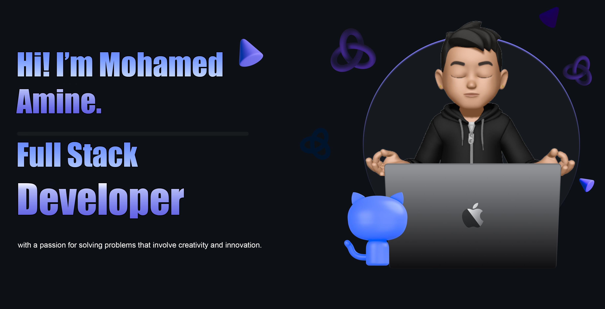

 
 <!--Header-->

 

 

 

<!--Intro-->

 
## 𝐇𝐞𝐥𝐥𝐨 𝐭𝐡𝐞𝐫𝐞, 𝐟𝐞𝐥𝐥𝐨𝐰 <𝚌𝚘𝚍𝚎𝚛 />! 

### Congratulations you found me

- 👨‍💻 I’m currently working on web development technologies like `Spring Boot`, `Angular`, `React` etc.
- 📚 I’m currently learning **JAVA , REACT** 😅
- 💪🏼 Future Goals: Learn more technologies, Never stop creating new ideas.

<!--Contact-->

### Contact me:

  
  
 

<!--Skills-->

 

<h3 align="center">
 【Ｓｋｉｌｌｓ】  
</h3>

 
  

| **Programming_Languages**                           | **Frontend_Tools**                                      | **Backend_Tools**                                       | **Data_Related**                                      | **IDEs/Softwares**                                           | **Other_Tools**                                    |
| --------------------------------------------------- | -------------------------------------------------- | -------------------------------------------------- | -------------------------------------------------- | ---------------------------------------------------- | -------------------------------------------------- |
| 
 
| 
  
| 
 | 
 |
  |  
  |
| 
 | 
 | 
 | 
  |
  | 
  |
| 
 | 
  | 
 |  
 | 
 |
   |
|
  | 
 |
  |                                                   |
  |
   |
| 
 | 
 | 
 |                                                |
   | 
                       |                                            |
| 
  |                                                |                                                        |                                                    |  
       |  
  |                                                 |

 

<!--More REPOSITORIES-->

  
📁 More Repositories

   

  

### 𝚂𝚑𝚘𝚠 𝚜𝚘𝚖𝚎 💙 𝚋𝚢 𝚜𝚝𝚊𝚛𝚛𝚒𝚗𝚐 ⭐ 𝚜𝚘𝚖𝚎 𝚘𝚏 𝚝𝚑𝚎 𝚛𝚎𝚙𝚘𝚜𝚒𝚝𝚘𝚛𝚒𝚎𝚜!
 

 

<!--SPOTIFY-->

  

<!--Hobbies Section-->

<h2 align="center">
   【H o b b i e s】
</h2>

🎵 Music | 📚 Reading | 🎮 Gaming | ✈️ Traveling | 📸 Photography | 🍳 Cooking

<!--spotify CARD-->

 
<h4 align="center">
<!-- Currently Coding and Listening -->
</h4>
 

  
  

<!--MORE SONGS-->

  
💚 More

   

  
<!--QUOTE-->
  
  

 

<!-- views-->
  

 

⏳  𝚈𝚘𝚞 𝚑𝚊𝚟𝚎 𝚜𝚝𝚊𝚢𝚎𝚍 𝚘𝚗 𝚖𝚢 𝚙𝚛𝚘𝚏𝚒𝚕𝚎 𝚏𝚘𝚛 ◔_◔ ⌛
  

 

 
 

 <!--MOON-->
<a href="https://github.com/aminexfrad"> 
  
<a href="https://github.com/aminexfrad"> 
  
 

 

